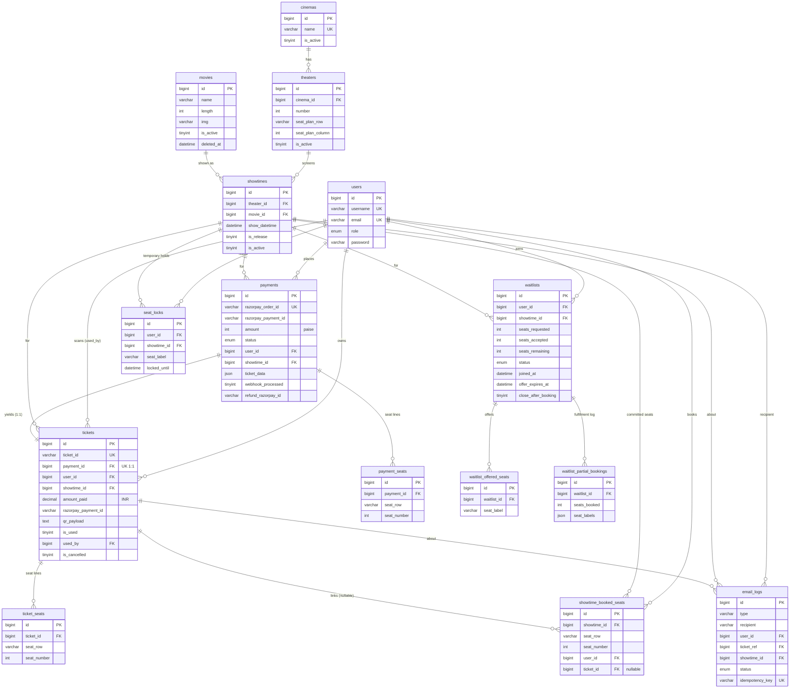

# CineBooker — Entity-Relationship Diagram (MySQL)

15 tables, InnoDB, `utf8mb4`. All PKs are `BIGINT AUTO_INCREMENT`.
Soft-delete (`is_active` / `deleted_at`) on catalog tables; `ON DELETE RESTRICT`
into every historical/financial FK so bookings, tickets, payments and refunds are
never cascade-deleted. Only pure child rows and `seat_locks` cascade.

## Concurrency-critical constraints
- `UNIQUE(showtime_id, seat_row, seat_number)` on **showtime_booked_seats** — the
  hard double-booking guard. Two payments racing for one seat: the second `INSERT`
  fails with `ER_DUP_ENTRY`, so a seat is committed **exactly once**.
- `UNIQUE(showtime_id, seat_label)` on **seat_locks** — one active hold per seat.
- `UNIQUE(user_id, showtime_id)` on **waitlists** — one waitlist entry per user/showtime.
- `UNIQUE(idempotency_key)` on **email_logs** (sparse; MySQL allows multiple NULLs) —
  idempotent email sends.
- `UNIQUE(payment_id)` on **tickets** — a payment yields at most one ticket (idempotent finalize).
